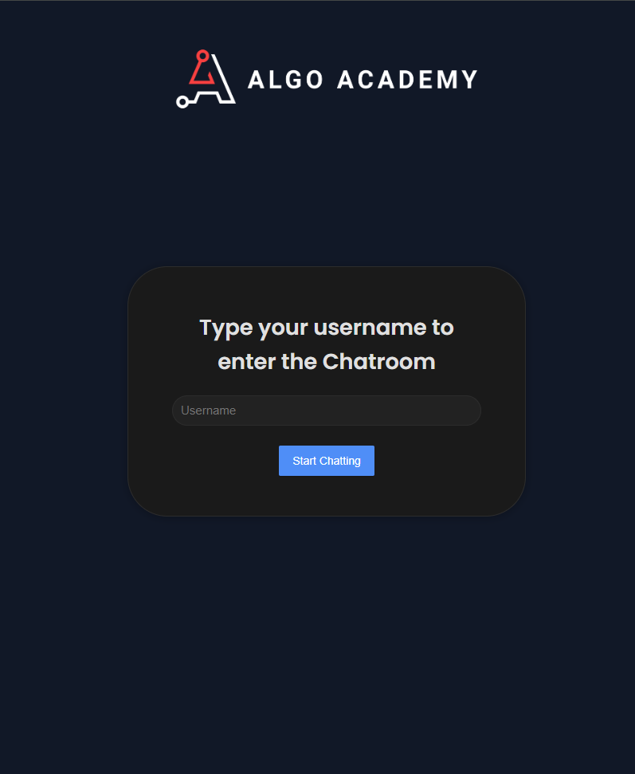
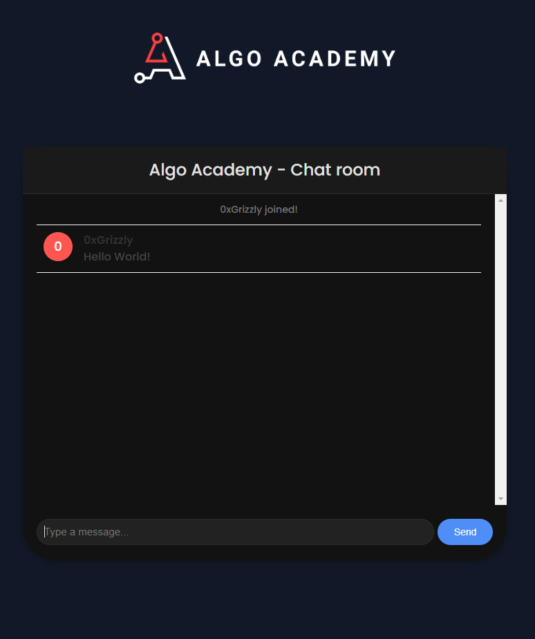
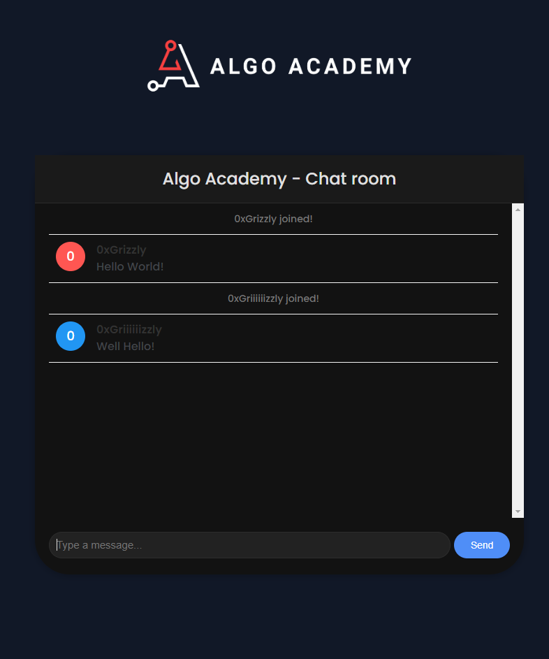

# Algo Academy Chatroom

## Introduction

This project was developed as a practice exercise for incorporation into my Algo Academy website. It is constructed using Java and Spring Boot, and leverages webhooks for enhanced functionality.

## Features
- User login with a username.
- Real-time messaging.
- User join and leave notifications.
- View other users' messages.
- Fast message delivery with webhooks.

## Screenshots
### User Login

### Chatroom

### User join

